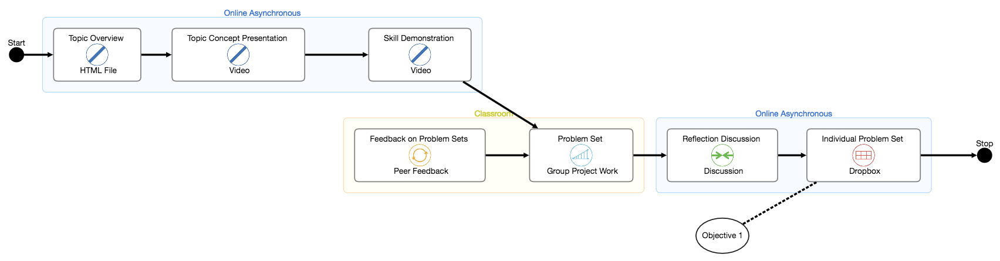

## lem GET response


```JSON
{
  "_id": {
    "$oid": "58de81a29a93ac144a594fa7"
  },
  "name": "test",
  "created_by": "newemail@email.com",
  "date_created": {
    "$date": 1490958997377
  },
  "startIDs": [
    1
  ],
  "stopIDs": [
    7
  ],
  "building_blocks": [
    {
      "id": 1,
      "block_type": "Information",
      "description": "Topic Overview",
      "method": "HTML File"
    },
    {
      "id": 2,
      "block_type": "Information",
      "description": "Topic Concept Presentation",
      "method": "Video"
    },
    {
      "id": 3,
      "block_type": "Information",
      "description": "Skill Demonstration",
      "method": "Video"
    },
    {
      "id": 4,
      "block_type": "Practice",
      "description": "Problem Set",
      "method": "Group Project Work"
    },
    {
      "id": 5,
      "block_type": "Feedback",
      "description": "Feedback on Problem Sets",
      "method": "Peer Feedback"
    },
    {
      "id": 6,
      "block_type": "Dialogue",
      "description": "Reflection Discussion",
      "method": "Discussion"
    },
    {
      "id": 7,
      "block_type": "Evidence",
      "description": "Individual Problem Set",
      "method": "Dropbox"
    }
  ],
  "contexts": [
    {
      "id": 14,
      "context_type": "Online Asynchronous",
      "building_blocks": [
        1,
        2,
        3
      ],
      "notations": [

      ]
    },
    {
      "id": 15,
      "context_type": "Classroom",
      "building_blocks": [
        4,
        5
      ],
      "notations": [

      ]
    },
    {
      "id": 16,
      "context_type": "Online Asynchronous",
      "building_blocks": [
        6,
        7
      ],
      "notations": [

      ]
    }
  ],
  "actions": [
    {
      "id": 8,
      "action_type": "Learner Action",
      "source": 1,
      "target": 2
    },
    {
      "id": 9,
      "action_type": "Learner Action",
      "source": 2,
      "target": 3
    },
    {
      "id": 10,
      "action_type": "Learner Action",
      "source": 3,
      "target": 4
    },
    {
      "id": 11,
      "action_type": "Learner Action",
      "source": 4,
      "target": 6
    },
    {
      "id": 12,
      "action_type": "Learner Action",
      "source": 5,
      "target": 4
    },
    {
      "id": 13,
      "action_type": "Learner Action",
      "source": 6,
      "target": 7
    }
  ],
  "notations": [
    {
      "building_block": 7,
      "description": "Objective 1"
    }
  ],
  "ratings": [
    6,
    5,
    3,
    4,
    4,
    4,
    4,
    4,
    5,
    5,
    5,
    5,
    5,
    5,
    4,
    4,
    5,
    5,
    4,
    5,
    4,
    1,
    1
  ],
  "avgRating": 3,
  "thumbnail": "data:image\/png;base64,iVBORw0KGgo...K5CYII=",
  "public": 1
}
```


## lem POST Body
```json
{
  "contexts": [
    {
      "id": 14,
      "context_type": "Online Asynchronous",
      "building_blocks": [
        1,
        2,
        3
      ],
      "notations": []
    },
    {
      "id": 15,
      "context_type": "Classroom",
      "building_blocks": [
        4,
        5
      ],
      "notations": []
    },
    {
      "id": 16,
      "context_type": "Online Asynchronous",
      "building_blocks": [
        6,
        7
      ],
      "notations": []
    }
  ],
  "building_blocks": [
    {
      "id": 1,
      "block_type": "Information",
      "description": "Topic Overview",
      "method": "HTML File",
      "parent": "14"
    },
    {
      "id": 2,
      "block_type": "Information",
      "description": "Topic Concept Presentation",
      "method": "Video",
      "parent": "14"
    },
    {
      "id": 3,
      "block_type": "Information",
      "description": "Skill Demonstration",
      "method": "Video",
      "parent": "14"
    },
    {
      "id": 4,
      "block_type": "Practice",
      "description": "Problem Set",
      "method": "Group Project Work",
      "parent": "15"
    },
    {
      "id": 5,
      "block_type": "Feedback",
      "description": "Feedback on Problem Sets",
      "method": "Peer Feedback",
      "parent": "15"
    },
    {
      "id": 6,
      "block_type": "Dialogue",
      "description": "Reflection Discussion",
      "method": "Discussion",
      "parent": "16"
    },
    {
      "id": 7,
      "block_type": "Evidence",
      "description": "Individual Problem Set",
      "method": "Dropbox",
      "parent": "16"
    }
  ],
  "notations": [
    {
      "building_block": 7,
      "description": "Objective 1",
      "id": null
    }
  ],
  "actions": [
    {
      "id": 8,
      "action_type": "Learner Action",
      "source": 1,
      "target": 2
    },
    {
      "id": 9,
      "action_type": "Learner Action",
      "source": 2,
      "target": 3
    },
    {
      "id": 10,
      "action_type": "Learner Action",
      "source": 3,
      "target": 4
    },
    {
      "id": 11,
      "action_type": "Learner Action",
      "source": 4,
      "target": 6
    },
    {
      "id": 12,
      "action_type": "Learner Action",
      "source": 5,
      "target": 4
    },
    {
      "id": 13,
      "action_type": "Learner Action",
      "source": 6,
      "target": 7
    }
  ],
  "startIDs": [1],
  "stopIDs": [7],
  "name": "testName",
  "public": 0,
  "thumbnail": "data:image/png;base64,iVBORw0KGgoA..."
}
```

## lemall Response
```json
[
  {
    "_id": {
      "$oid": "58de81a29a93ac144a594fa7"
    },
    "name": "test",
    "created_by": "newemail@email.com",
    "date_created": {
      "$date": 1490958997377
    },
    "startIDs": [
      1
    ],
    "stopIDs": [
      7
    ],
    "building_blocks": [
      {
        "id": 1,
        "block_type": "Information",
        "description": "Topic Overview",
        "method": "HTML File"
      },
      {
        "id": 2,
        "block_type": "Information",
        "description": "Topic Concept Presentation",
        "method": "Video"
      },
      {
        "id": 3,
        "block_type": "Information",
        "description": "Skill Demonstration",
        "method": "Video"
      },
      {
        "id": 4,
        "block_type": "Practice",
        "description": "Problem Set",
        "method": "Group Project Work"
      },
      {
        "id": 5,
        "block_type": "Feedback",
        "description": "Feedback on Problem Sets",
        "method": "Peer Feedback"
      },
      {
        "id": 6,
        "block_type": "Dialogue",
        "description": "Reflection Discussion",
        "method": "Discussion"
      },
      {
        "id": 7,
        "block_type": "Evidence",
        "description": "Individual Problem Set",
        "method": "Dropbox"
      }
    ],
    "contexts": [
      {
        "id": 14,
        "context_type": "Online Asynchronous",
        "building_blocks": [
          1,
          2,
          3
        ],
        "notations": [

        ]
      },
      {
        "id": 15,
        "context_type": "Classroom",
        "building_blocks": [
          4,
          5
        ],
        "notations": [

        ]
      },
      {
        "id": 16,
        "context_type": "Online Asynchronous",
        "building_blocks": [
          6,
          7
        ],
        "notations": [

        ]
      }
    ],
    "actions": [
      {
        "id": 8,
        "action_type": "Learner Action",
        "source": 1,
        "target": 2
      },
      {
        "id": 9,
        "action_type": "Learner Action",
        "source": 2,
        "target": 3
      },
      {
        "id": 10,
        "action_type": "Learner Action",
        "source": 3,
        "target": 4
      },
      {
        "id": 11,
        "action_type": "Learner Action",
        "source": 4,
        "target": 6
      },
      {
        "id": 12,
        "action_type": "Learner Action",
        "source": 5,
        "target": 4
      },
      {
        "id": 13,
        "action_type": "Learner Action",
        "source": 6,
        "target": 7
      }
    ],
    "notations": [
      {
        "building_block": 7,
        "description": "Objective 1"
      }
    ],
    "ratings": [
      6,
      5,
      3,
      4,
      4,
      4,
      4,
      4,
      5,
      5,
      5,
      5,
      5,
      5,
      4,
      4,
      5,
      5,
      4,
      5,
      4,
      1,
      1
    ],
    "avgRating": 3,
    "thumbnail": "data:image\/png;base64,iVBORw0KG...VORK5CYII=",
    "public": 1
  },
  {
    "_id": {
      "$oid": "58de826e9a93ac14ffbaab6b"
    },
    "name": "anothertest",
    "created_by": "newemail@email.com",
    "date_created": {
      "$date": 1490959352160
    },
    "startIDs": [
      1
    ],
    "stopIDs": [
      7
    ],
    "building_blocks": [
      {
        "id": 1,
        "block_type": "Information",
        "description": "Topic Overview",
        "method": "HTML File"
      },
      {
        "id": 2,
        "block_type": "Information",
        "description": "Topic Concept Presentation",
        "method": "Video"
      },
      {
        "id": 3,
        "block_type": "Information",
        "description": "Skill Demonstration",
        "method": "Video"
      },
      {
        "id": 4,
        "block_type": "Practice",
        "description": "Problem Set",
        "method": "Group Project Work"
      },
      {
        "id": 5,
        "block_type": "Feedback",
        "description": "Feedback on Problem Sets",
        "method": "Peer Feedback"
      },
      {
        "id": 6,
        "block_type": "Dialogue",
        "description": "Reflection Discussion",
        "method": "Discussion"
      },
      {
        "id": 7,
        "block_type": "Evidence",
        "description": "Individual Problem Set",
        "method": "Dropbox"
      }
    ],
    "contexts": [
      {
        "id": 14,
        "context_type": "Online Asynchronous",
        "building_blocks": [
          1,
          2,
          3
        ],
        "notations": [

        ]
      },
      {
        "id": 15,
        "context_type": "Classroom",
        "building_blocks": [
          4,
          5
        ],
        "notations": [

        ]
      },
      {
        "id": 16,
        "context_type": "Online Asynchronous",
        "building_blocks": [
          6,
          7
        ],
        "notations": [

        ]
      }
    ],
    "actions": [
      {
        "id": 8,
        "action_type": "Learner Action",
        "source": 1,
        "target": 2
      },
      {
        "id": 9,
        "action_type": "Learner Action",
        "source": 2,
        "target": 3
      },
      {
        "id": 10,
        "action_type": "Learner Action",
        "source": 3,
        "target": 4
      },
      {
        "id": 11,
        "action_type": "Learner Action",
        "source": 4,
        "target": 6
      },
      {
        "id": 12,
        "action_type": "Learner Action",
        "source": 5,
        "target": 4
      },
      {
        "id": 13,
        "action_type": "Learner Action",
        "source": 6,
        "target": 7
      }
    ],
    "notations": [
      {
        "building_block": 7,
        "description": "Objective 1"
      }
    ],
    "ratings": [
      5,
      5,
      4,
      3,
      1,
      3,
      1
    ],
    "avgRating": 3.1428571428571,
    "thumbnail": "data:image\/png;base64,iVBOR...5CYII=",
    "public": 1
  },
  {
    "_id": {
      "$oid": "58de90cfcf367e0e111d96f1"
    },
    "name": "testPublic",
    "created_by": "nickbgraham83@gmail.com",
    "date_created": {
      "$date": 1490963025206
    },
    "startIDs": [
      104
    ],
    "stopIDs": [
      117
    ],
    "building_blocks": [
      {
        "id": 104,
        "block_type": "Information",
        "description": "Introduction",
        "method": "Live Presentation"
      },
      {
        "id": 105,
        "block_type": "Dialogue",
        "description": "Getting to Know You",
        "method": "Discussion Excercise"
      },
      {
        "id": 109,
        "block_type": "Information",
        "description": "Lecture",
        "method": "Video"
      },
      {
        "id": 111,
        "block_type": "Dialogue",
        "description": "Topic Discussion",
        "method": "Discussion"
      },
      {
        "id": 113,
        "block_type": "Practice",
        "description": "Exercise Practice",
        "method": "Dropbox"
      },
      {
        "id": 117,
        "block_type": "Evidence",
        "description": "Presentation",
        "method": "Live Presentation"
      },
      {
        "id": 118,
        "block_type": "Feedback",
        "description": "Feedback on Presentation",
        "method": "Instructor Feedback"
      }
    ],
    "contexts": [
      {
        "id": 108,
        "context_type": "Classroom",
        "building_blocks": [
          104,
          105
        ],
        "notations": [

        ]
      },
      {
        "id": 116,
        "context_type": "Online Asynchronous",
        "building_blocks": [
          109,
          111,
          113
        ],
        "notations": [

        ]
      },
      {
        "id": 124,
        "context_type": "Classroom",
        "building_blocks": [
          117,
          118
        ],
        "notations": [

        ]
      }
    ],
    "actions": [
      {
        "id": 107,
        "action_type": "Facilitator Action",
        "source": 104,
        "target": 105
      },
      {
        "id": 110,
        "action_type": "Learner Action",
        "source": 105,
        "target": 109
      },
      {
        "id": 114,
        "action_type": "Learner Action",
        "source": 109,
        "target": 111
      },
      {
        "id": 115,
        "action_type": "Learner Action",
        "source": 111,
        "target": 113
      },
      {
        "id": 120,
        "action_type": "Learner Action",
        "source": 113,
        "target": 117
      },
      {
        "id": 119,
        "action_type": "Facilitator Action",
        "source": 118,
        "target": 117
      }
    ],
    "notations": [
      {
        "building_block": 117,
        "description": "Objective ID"
      }
    ],
    "ratings": [

    ],
    "avgRating": 5,
    "thumbnail": "data:image\/png;base64,iVB...K5CYII=",
    "public": 1
  }
]
```

## Get comments response
```JSON
[
  {
    "_id": {
      "$oid": "58e79f20cf367e28e8e2624a"
    },
    "lem_id": "58de81a29a93ac144a594fa7",
    "text": "testagd",
    "created_by": "nickbgraham83@gmail.com",
    "date_created": {
      "$date": 1491554899172
    }
  },
  {
    "_id": {
      "$oid": "58e7a090cf367e28e8e2624b"
    },
    "lem_id": "58de81a29a93ac144a594fa7",
    "text": "dahgsdg",
    "created_by": "nickbgraham83@gmail.com",
    "date_created": {
      "$date": 1491554899172
    }
  },
  {
    "_id": {
      "$oid": "58e7a13dcf367e32e39c4d9f"
    },
    "lem_id": "58de81a29a93ac144a594fa7",
    "text": "adgs",
    "created_by": "nickbgraham83@gmail.com",
    "date_created": {
      "$date": 1491557059524
    }
  },
  {
    "_id": {
      "$oid": "58e7a174cf367e334fe0b798"
    },
    "lem_id": "58de81a29a93ac144a594fa7",
    "text": "ahdshs",
    "created_by": "nickbgraham83@gmail.com",
    "date_created": {
      "$date": 1491557142159
    }
  },
  {
    "_id": {
      "$oid": "58e7a195cf367e337e321174"
    },
    "lem_id": "58de81a29a93ac144a594fa7",
    "text": "adgag",
    "created_by": "nickbgraham83@gmail.com",
    "date_created": {
      "$date": 1491557179550
    }
  },
  {
    "_id": {
      "$oid": "58e7a203cf367e33fc346744"
    },
    "lem_id": "58de81a29a93ac144a594fa7",
    "text": "adg",
    "created_by": "nickbgraham83@gmail.com",
    "date_created": {
      "$date": 1491557287673
    }
  },
  {
    "_id": {
      "$oid": "58e7a29ccf367e33fc346745"
    },
    "lem_id": "58de81a29a93ac144a594fa7",
    "text": "My comment",
    "created_by": "nickbgraham83@gmail.com",
    "date_created": {
      "$date": 1491557287673
    }
  },
  {
    "_id": {
      "$oid": "58e7a72dcf367e37f4208035"
    },
    "lem_id": "58de81a29a93ac144a594fa7",
    "text": "This is a test",
    "created_by": "nickbgraham83@gmail.com",
    "date_created": {
      "$date": 1491558102337
    }
  },
  {
    "_id": {
      "$oid": "58e7bd17cf367e453cd2030b"
    },
    "lem_id": "58de81a29a93ac144a594fa7",
    "text": "das",
    "created_by": "nickbgraham83@gmail.com",
    "date_created": {
      "$date": 1491564209226
    }
  },
  {
    "_id": {
      "$oid": "58e7bd4dcf367e453cd2030c"
    },
    "lem_id": "58de81a29a93ac144a594fa7",
    "text": "asgda",
    "created_by": "nickbgraham83@gmail.com",
    "date_created": {
      "$date": 1491564209226
    }
  }
]
```

## GET Favorites Response
```JSON
[
  {
    "_id": {
      "$oid": "58de81a29a93ac144a594fa7"
    },
    "name": "test",
    "created_by": "newemail@email.com",
    "date_created": {
      "$date": 1490958997377
    },
    "startIDs": [
      1
    ],
    "stopIDs": [
      7
    ],
    "building_blocks": [
      {
        "id": 1,
        "block_type": "Information",
        "description": "Topic Overview",
        "method": "HTML File"
      },
      {
        "id": 2,
        "block_type": "Information",
        "description": "Topic Concept Presentation",
        "method": "Video"
      },
      {
        "id": 3,
        "block_type": "Information",
        "description": "Skill Demonstration",
        "method": "Video"
      },
      {
        "id": 4,
        "block_type": "Practice",
        "description": "Problem Set",
        "method": "Group Project Work"
      },
      {
        "id": 5,
        "block_type": "Feedback",
        "description": "Feedback on Problem Sets",
        "method": "Peer Feedback"
      },
      {
        "id": 6,
        "block_type": "Dialogue",
        "description": "Reflection Discussion",
        "method": "Discussion"
      },
      {
        "id": 7,
        "block_type": "Evidence",
        "description": "Individual Problem Set",
        "method": "Dropbox"
      }
    ],
    "contexts": [
      {
        "id": 14,
        "context_type": "Online Asynchronous",
        "building_blocks": [
          1,
          2,
          3
        ],
        "notations": [

        ]
      },
      {
        "id": 15,
        "context_type": "Classroom",
        "building_blocks": [
          4,
          5
        ],
        "notations": [

        ]
      },
      {
        "id": 16,
        "context_type": "Online Asynchronous",
        "building_blocks": [
          6,
          7
        ],
        "notations": [

        ]
      }
    ],
    "actions": [
      {
        "id": 8,
        "action_type": "Learner Action",
        "source": 1,
        "target": 2
      },
      {
        "id": 9,
        "action_type": "Learner Action",
        "source": 2,
        "target": 3
      },
      {
        "id": 10,
        "action_type": "Learner Action",
        "source": 3,
        "target": 4
      },
      {
        "id": 11,
        "action_type": "Learner Action",
        "source": 4,
        "target": 6
      },
      {
        "id": 12,
        "action_type": "Learner Action",
        "source": 5,
        "target": 4
      },
      {
        "id": 13,
        "action_type": "Learner Action",
        "source": 6,
        "target": 7
      }
    ],
    "notations": [
      {
        "building_block": 7,
        "description": "Objective 1"
      }
    ],
    "ratings": [
      6,
      5,
      3,
      4,
      4,
      4,
      4,
      4,
      5,
      5,
      5,
      5,
      5,
      5,
      4,
      4,
      5,
      5,
      4,
      5,
      4,
      1,
      1
    ],
    "avgRating": 3,
    "thumbnail": "data:image\/png;base64,iVBORw0KGgoAAAAN...UVORK5CYII=",
    "public": 1
  },
  {
    "_id": {
      "$oid": "58de826e9a93ac14ffbaab6b"
    },
    "name": "anothertest",
    "created_by": "newemail@email.com",
    "date_created": {
      "$date": 1490959352160
    },
    "startIDs": [
      1
    ],
    "stopIDs": [
      7
    ],
    "building_blocks": [
      {
        "id": 1,
        "block_type": "Information",
        "description": "Topic Overview",
        "method": "HTML File"
      },
      {
        "id": 2,
        "block_type": "Information",
        "description": "Topic Concept Presentation",
        "method": "Video"
      },
      {
        "id": 3,
        "block_type": "Information",
        "description": "Skill Demonstration",
        "method": "Video"
      },
      {
        "id": 4,
        "block_type": "Practice",
        "description": "Problem Set",
        "method": "Group Project Work"
      },
      {
        "id": 5,
        "block_type": "Feedback",
        "description": "Feedback on Problem Sets",
        "method": "Peer Feedback"
      },
      {
        "id": 6,
        "block_type": "Dialogue",
        "description": "Reflection Discussion",
        "method": "Discussion"
      },
      {
        "id": 7,
        "block_type": "Evidence",
        "description": "Individual Problem Set",
        "method": "Dropbox"
      }
    ],
    "contexts": [
      {
        "id": 14,
        "context_type": "Online Asynchronous",
        "building_blocks": [
          1,
          2,
          3
        ],
        "notations": [

        ]
      },
      {
        "id": 15,
        "context_type": "Classroom",
        "building_blocks": [
          4,
          5
        ],
        "notations": [

        ]
      },
      {
        "id": 16,
        "context_type": "Online Asynchronous",
        "building_blocks": [
          6,
          7
        ],
        "notations": [

        ]
      }
    ],
    "actions": [
      {
        "id": 8,
        "action_type": "Learner Action",
        "source": 1,
        "target": 2
      },
      {
        "id": 9,
        "action_type": "Learner Action",
        "source": 2,
        "target": 3
      },
      {
        "id": 10,
        "action_type": "Learner Action",
        "source": 3,
        "target": 4
      },
      {
        "id": 11,
        "action_type": "Learner Action",
        "source": 4,
        "target": 6
      },
      {
        "id": 12,
        "action_type": "Learner Action",
        "source": 5,
        "target": 4
      },
      {
        "id": 13,
        "action_type": "Learner Action",
        "source": 6,
        "target": 7
      }
    ],
    "notations": [
      {
        "building_block": 7,
        "description": "Objective 1"
      }
    ],
    "ratings": [
      5,
      5,
      4,
      3,
      1,
      3,
      1
    ],
    "avgRating": 3.1428571428571,
    "thumbnail": "data:image\/png;base64,iVBORw0KG...UVORK5CYII=",
    "public": 1
  },
  {
    "_id": {
      "$oid": "58de94c29a93ac0ca69f1f47"
    },
    "name": "publicaustin",
    "created_by": "newemail@email.com",
    "date_created": {
      "$date": 1490963948269
    },
    "startIDs": [
      1
    ],
    "stopIDs": [
      7
    ],
    "building_blocks": [
      {
        "id": 1,
        "block_type": "Information",
        "description": "Topic Overview",
        "method": "HTML File"
      },
      {
        "id": 2,
        "block_type": "Information",
        "description": "Topic Concept Presentation",
        "method": "Video"
      },
      {
        "id": 3,
        "block_type": "Information",
        "description": "Skill Demonstration",
        "method": "Video"
      },
      {
        "id": 4,
        "block_type": "Practice",
        "description": "Problem Set",
        "method": "Group Project Work"
      },
      {
        "id": 5,
        "block_type": "Feedback",
        "description": "Feedback on Problem Sets",
        "method": "Peer Feedback"
      },
      {
        "id": 6,
        "block_type": "Dialogue",
        "description": "Reflection Discussion",
        "method": "Discussion"
      },
      {
        "id": 7,
        "block_type": "Evidence",
        "description": "Individual Problem Set",
        "method": "Dropbox"
      }
    ],
    "contexts": [
      {
        "id": 14,
        "context_type": "Online Asynchronous",
        "building_blocks": [
          1,
          2,
          3
        ],
        "notations": [

        ]
      },
      {
        "id": 15,
        "context_type": "Classroom",
        "building_blocks": [
          4,
          5
        ],
        "notations": [

        ]
      },
      {
        "id": 16,
        "context_type": "Online Asynchronous",
        "building_blocks": [
          6,
          7
        ],
        "notations": [

        ]
      }
    ],
    "actions": [
      {
        "id": 8,
        "action_type": "Learner Action",
        "source": 1,
        "target": 2
      },
      {
        "id": 9,
        "action_type": "Learner Action",
        "source": 2,
        "target": 3
      },
      {
        "id": 10,
        "action_type": "Learner Action",
        "source": 3,
        "target": 4
      },
      {
        "id": 11,
        "action_type": "Learner Action",
        "source": 4,
        "target": 6
      },
      {
        "id": 12,
        "action_type": "Learner Action",
        "source": 5,
        "target": 4
      },
      {
        "id": 13,
        "action_type": "Learner Action",
        "source": 6,
        "target": 7
      }
    ],
    "notations": [
      {
        "building_block": 7,
        "description": "Objective 1"
      }
    ],
    "ratings": [

    ],
    "avgRating": 0,
    "thumbnail": "data:image\/png;base64,iVBOR...uQmCC",
    "public": 1
  }
]
```
